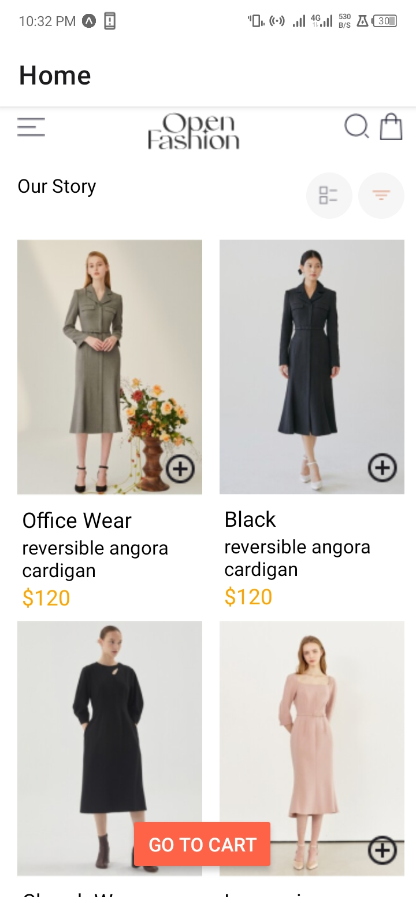
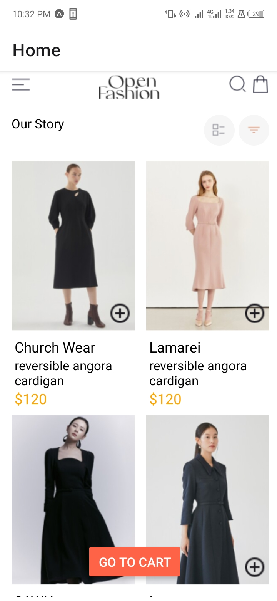
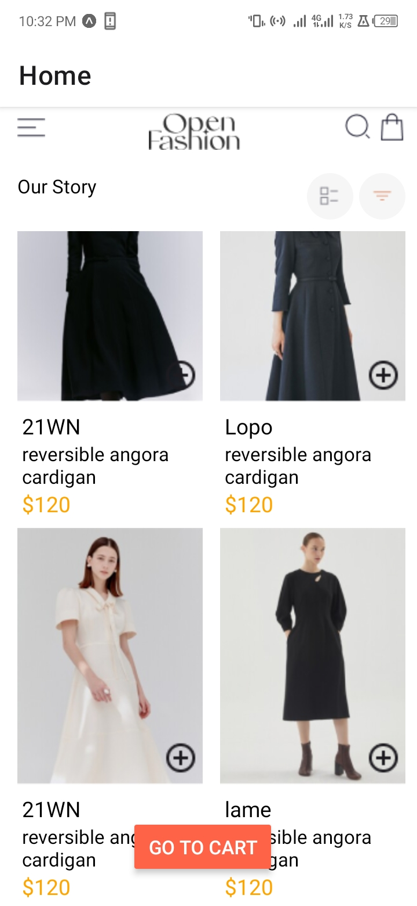
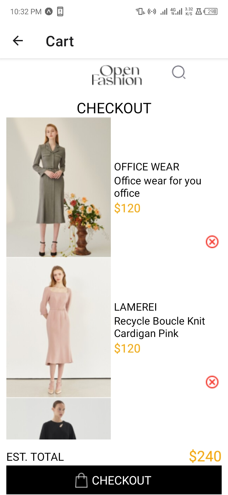
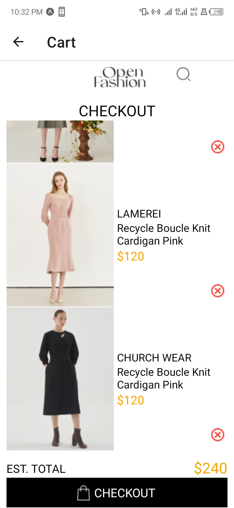

# rn-assignment6-11102684

## Welcome to my DressUp APP
### HomeScreen
The Home screen displays a list of items using a FlatList which allows a user to add an item from the list to cart. There is a "Go to Cart" button which takes a user to another screen where he can view the items he added to cart. Here are screenshots of the home screen.

### CartScreen
This screen displays the list of items the user selected on the home screen. It has a button that allows a user to remove items from cart. It has a checkout button as well.

